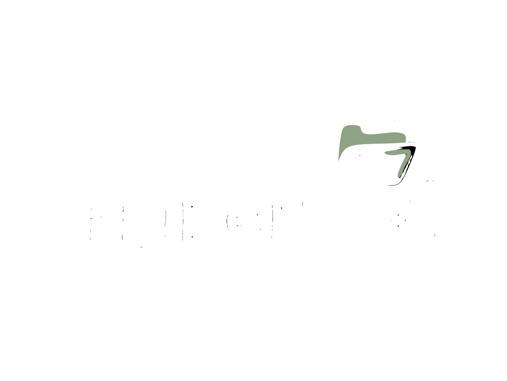

<p align="center">
  <a href="https://coubeche.hypeer.cloud">
    
  </a>
</p>


<p align="center">
  <strong>Tout ce dont vous avez besoin. Rien de superflu.</strong>
</p>

<p align="center">
  Plateforme de gestion Kanban centralisée permettant aux 4 branches de l'entreprise <strong>Coubeche</strong> de suivre, organiser et coordonner efficacement les tâches, projets et validations en temps réel.
</p>

<p align="center">
  <a href="LICENSE"></a>
  <a href="https://github.com/SamalehZen/HyperFix/actions"></a>
</p>

---

## Fonctionnalités principales

- **Tableaux Kanban** par projet, organisés par workspace
- **Backlog & sprints** pour planifier le travail
- **Diagramme de Gantt** pour visualiser les délais
- **Collaboration temps réel** via WebSockets
- **Commentaires, pièces jointes, validations** par tâche
- **Notifications** in-app, email, Slack, Discord, Telegram, webhooks génériques
- **Intégrations** GitHub & Gitea pour synchroniser les issues
- **SSO** GitHub, Google, Discord ou OAuth/OIDC custom
- **Auto-hébergé** : Docker, Docker Compose, ou Kubernetes (Helm)

## Stack technique

- **Backend** : Hono, PostgreSQL, Drizzle ORM, Better Auth, Valibot
- **Frontend** : React 19, TanStack Router & Query, Tailwind CSS, Vite
- **Monorepo** : pnpm + Turborepo
- **Conteneurs** : Docker multi-arch (amd64/arm64)

## Déploiement rapide (Docker Compose)

```bash
git clone https://github.com/SamalehZen/HyperFix.git
cd HyperFix
cp .env.sample .env
# Édite .env avec ton AUTH_SECRET et tes credentials Postgres
docker compose up -d
```

L'app sera dispo sur http://localhost:5173.

## Images Docker

Publiées sur GitHub Container Registry (multi-arch amd64/arm64) :

- `ghcr.io/samalehzen/hyper:1.0.0` — image tout-en-un (recommandé pour la prod)
- `ghcr.io/samalehzen/hyper-api:1.0.0` — backend seul
- `ghcr.io/samalehzen/hyper-web:1.0.0` — frontend seul

Pour la prod, **utilise toujours un tag versionné** (`:1.0.0`) plutôt que `:latest`.

## Développement local

```bash
pnpm install
pnpm dev
```

- API : http://localhost:1337
- Web : http://localhost:5173

## Licence

MIT © 2026 Samaleh Mohamed Hassan
